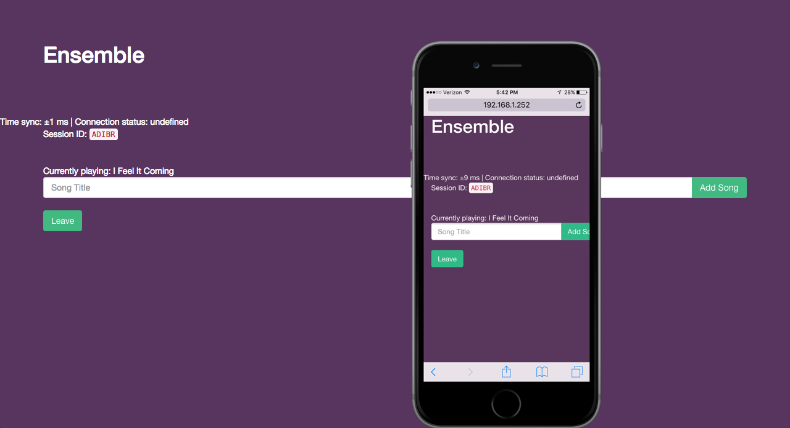

# Ensemble: listen to music together

_Have you ever been to a party where the speakers weren’t loud enough? Or worse, where there weren’t any speakers at all? Ensemble can help. Ensemble allows you and your friends to simultaneously play music on all of your devices (phones, computers, iPads, anything else) so that it sounds like an insanely loud distributed super-speaker. You can play any song, and it is synced perfectly!_

This project won first place at the 2017 MIT Blueprint hackathon. It was created by [Harshal Sheth](http://harshalsheth.com/), [Andrew Sun](https://andrewsun.com/), [Kartik Singh](https://github.com/kartik-s), and [Nihar Sheth](https://github.com/nsheth12).

## Usage
1. Install the dependencies using `yarn`. You will also need `youtube-dl`.
2. First start the deepstream server: `node server/deepstream.js`.
3. Start the server: `yarn run server`.
4. Start the development server: `yarn run start`.
5. The server should be running at `<your IP or localhost>:3000`. Be patient while it retrieves the necessary audio.

